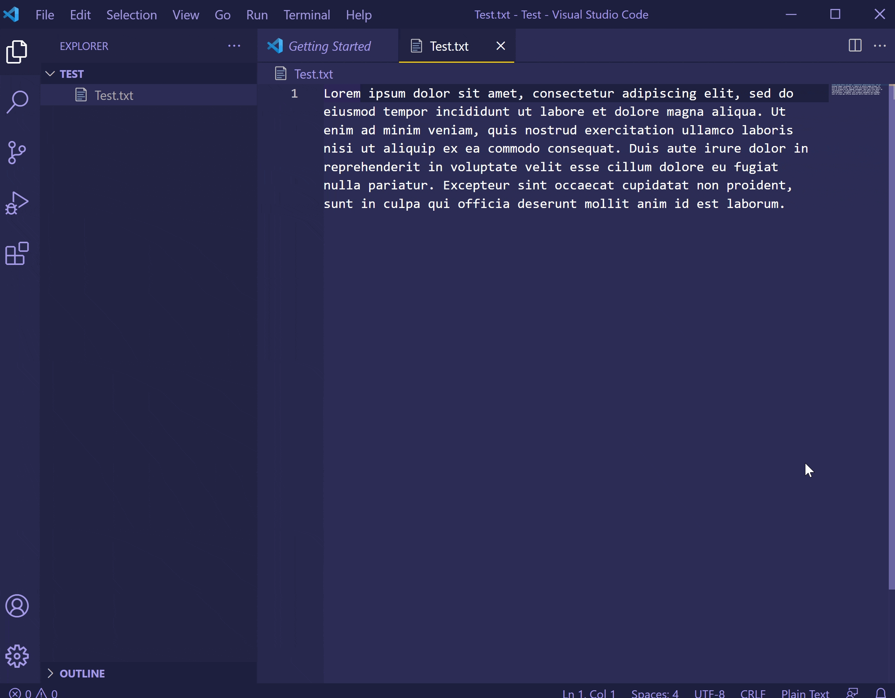

    

<h1 align="center">QR Code Generator</h1>

    <strong>A Visual Studio Code QR code generator</strong>

 

## Features
 * Generates a QR code for the selected text and display the QR code in a new window.
 * If no text is selected, a prompt is provided for the user to enter the text.

## Quick start

 1. Install the extension for Visual Studio Code
 2. Select a piece of text and right click.
 3. Choose "Generate QR Code" to generate the QR Code

    

## Author 

[Matt Seemon](@mattseemon)

Built with  in Goa, India.
